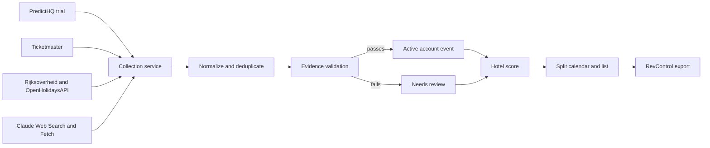

# HotelRevPar High Demand Tool: Version-One Design

Date: 2026-08-27
Status: Approved for implementation planning

## 1. Purpose

HotelRevPar will sell a subscription app to hotel owners and revenue managers who manage one or more hotels. Each subscriber uses the app to find demand-driving events for an isolated portfolio, inspect hotel-specific demand scores, and export selected months in RevControl's workbook format.

Robert will use the same operator workflow for the hotels he manages. His hotel clients will not receive logins.

## 2. Pilot Goal

The pilot must prove that a combined source strategy finds useful events for Eindhoven and Rotterdam across a rolling 12-month window. It must also prove that operators can turn those events into valid RevControl imports without repairing the workbook structure.

The pilot compares these source groups:

1. Rijksoverheid school holidays and OpenHolidaysAPI public holidays.
2. Ticketmaster Discovery API.
3. PredictHQ trial or paid-plan data with a 12-month visibility window.
4. Claude Web Search and Web Fetch for gaps in structured feeds.

The comparison records unique relevant events, duplicates, conflicts, missed known events, source failures, and review work.

## 3. Users and Access

### 3.1 Platform administrator

Robert has a platform-administrator account. It can:

- create and disable subscriber accounts;
- inspect source and collection health;
- use the full operator workflow for Robert's hotel portfolio.

Source credentials remain in Vercel environment settings rather than the app interface.

### 3.2 Subscriber operator

Each paying login is an operator with full control inside one account. An operator can:

- manage hotels and collection areas;
- run a collection for an area;
- browse events across one hotel or the full portfolio;
- review evidence conflicts and weak event candidates;
- exclude events and override hotel scores;
- export RevControl workbooks.

Every account sees its own hotels, areas, event decisions, score overrides, and exports. One account cannot read or change another account's portfolio data.

### 3.3 Manual subscription handling

Robert handles Plug&Pay checkout outside the app during the pilot. He creates and disables app accounts by hand. The app does not call Plug&Pay.

## 4. Version-One Scope

### 4.1 Included

- Separate app hosted on Vercel.
- HotelRevPar branding from the supplied logo and website screenshots.
- Email login through Supabase Auth.
- Portfolio setup with one or more hotels and collection areas.
- A rolling 12-month event window.
- One scheduled collection per week.
- A `Nu verversen` action for an operator's area.
- Source normalization, evidence storage, duplicate detection, and change detection.
- A fixed validation gate for Claude-found events.
- Hotel-specific scores from event data and distance.
- Split month view with a demand calendar and event list.
- Filters for hotel, area, month, category, distance, and score.
- Exception review for evidence gaps and conflicts.
- RevControl `.xlsx` export.

### 4.2 Deferred

- Plug&Pay API, webhook, or entitlement integration.
- Hotel-client logins.
- Subscriber event submissions.
- Revenue or occupancy data from RevControl.
- Price, supplement, or minimum-stay recommendations.
- Direct RevControl API integration.
- Machine-learning demand models.
- A separate job queue or worker service.

## 5. Product Interface

### 5.1 Brand system

The app uses the supplied HotelRevPar logo, a white workspace, dark blue navigation, cyan event accents, and orange primary actions. Proposed tokens from the supplied references are:

- dark blue: `#064B68`;
- primary blue: `#075F82`;
- cyan: `#0A99BD`;
- orange: `#FF5428`.

Implementation should compare these proposed tokens with the live website CSS before release. Color must not carry status by itself; every score and warning also needs text.

### 5.2 App shell

The desktop app uses a left sidebar:

- Vraagkalender
- Te beoordelen
- Hotels & regio's
- Exporteren
- Account

The header shows the active account, portfolio summary, and `Nu verversen` action.

### 5.3 Demand calendar

The main page uses the approved split view:

- a monthly demand calendar on the left;
- event details and month export on the right;
- hotel and month selectors above the split view;
- filters for category, distance, and score.

The operator may view one hotel or the full portfolio. A portfolio view shows event coverage across managed areas. Export requires one or more selected hotels.

### 5.4 Exception review

The review screen shows candidates that failed one or more validation checks. Each item includes:

- event title, date, and location;
- source URL and extracted evidence;
- the reason for review;
- possible duplicate or date conflict;
- affected hotels and suggested scores;
- actions to accept, edit, exclude, or merge.

An operator decision affects that operator's account. It has no effect on another subscriber.

## 6. Architecture

The pilot uses one Next.js application on Vercel and one Supabase project for Auth and Postgres.

### 6.1 Next.js responsibilities

- render authenticated operator pages;
- enforce session and role checks in every mutation and route;
- expose the secured Vercel Cron route;
- expose the account-scoped refresh route;
- run collection and normalization code;
- generate the workbook response.

Route handlers stay thin and call framework-independent collection, scoring, and export functions.

### 6.2 Supabase responsibilities

- authenticate users;
- store accounts, portfolios, events, evidence, decisions, scores, and run logs;
- enforce account isolation with Row Level Security operations.

The Supabase server secret stays in Vercel environment variables and never enters browser code. Browser requests use the user's session and Row Level Security.

### 6.3 Scheduling

Vercel Cron calls a secured route once per week. The route checks `CRON_SECRET` before it starts a run. The `Nu verversen` action checks the operator session and account before it calls the same collection function.

One active run may exist per collection area. A second request reports the active run rather than starting another source pass.

## 7. Data Model

The minimum tables are:

### `accounts`

- account identity and display name;
- active or disabled state;
- creation date.

### `account_members`

- Supabase Auth user ID;
- account ID;
- role: `operator` or `platform_admin`.

### `hotels`

- account ID;
- hotel name and RevControl hotel code;
- address, latitude, and longitude;
- adjustable demand radius.

### `collection_areas`

- account ID;
- city or region name;
- center coordinates and radius;
- enabled source set.

### `events`

- canonical title, category, venue, coordinates, start, end, state, and certainty;
- normalized identity used for cross-source duplicate matching;
- no source-owned metric without a matching evidence record.

### `event_sources`

- event ID;
- provider and provider event ID;
- source URL;
- extracted title, date, location, and evidence text;
- source check time, source state, and certainty;
- provider rank, attendance, or venue-capacity values when available.

### `account_events`

- account ID and event ID;
- state: `active`, `needs_review`, `excluded`, or `ended`;
- review reason and operator note;
- decision time and deciding user.

### `hotel_event_scores`

- hotel ID and event ID;
- calculated distance;
- score components and total;
- suggested importance and impact basis;
- operator override and note.

### `collection_runs`

- account and collection-area IDs;
- trigger: `cron` or `manual`;
- start and finish time;
- per-source status, counts, cost usage, and error summary.

## 8. Collection and Validation Flow

1. Determine the distinct enabled collection areas for the run.
2. Request events for the next 12 months from each enabled structured source. PredictHQ requests confirmed and predicted events.
3. Ask Claude to search for categories that structured feeds tend to miss, including university open days, local congresses, trade fairs, festivals, and regional events.
4. Normalize each candidate to the shared event fields.
5. Match provider IDs first. Then compare normalized title, date, venue, and coordinates for cross-source duplicates.
6. Merge exact matches into one event with several evidence records.
7. Send uncertain matches to review without merging them.
8. Run the evidence validation gate.
9. Create or update account-event state for accounts whose areas contain the event.
10. Calculate scores for affected hotels.
11. Record source counts, failures, and Anthropic search usage.

### 8.1 Structured-source validation

A structured-source event becomes active when it has:

- a provider event ID;
- a title;
- a start date;
- a location or regional scope;
- no unresolved duplicate or date conflict.

Confirmed and provisional certainty stay separate from account workflow state. A provisional event with usable dates and location may be active, visible, and exportable with a `Voorlopig` label. Certainty by itself does not create an exception.

### 8.2 Claude validation gate

A Claude-found event becomes active when all checks pass:

1. Claude provides a primary or trusted source URL from an organizer, venue, club, university, municipality, or comparable owner of the event information.
2. Web Fetch confirms the event title, date, and location on that page.
3. The event falls inside an enabled collection area and the rolling 12-month window.
4. No existing event has conflicting dates or probable duplicate details.
5. The page responds during the same collection run.

A failed check creates `needs_review` with a machine-readable reason. Claude's statement does not count as evidence without the source page.

### 8.3 Updates and cancellations

- A repeated provider event ID updates the existing source record.
- A date or location change creates `needs_review` for affected accounts.
- A cancellation creates `needs_review`; the app does not remove an event from an exportable calendar without an operator decision.
- A missing source response does not delete active data.
- An ended event leaves the active 12-month view after its end date.

## 9. Hotel-Specific Demand Score

The score uses event evidence and hotel distance. It does not use occupancy, bookings, revenue, or an AI opinion.

### 9.1 Event impact: 0 to 60

Use the first available input in this order:

1. PredictHQ Local Rank scaled from 0 to 100 into 0 to 60.
2. Published attendance.
3. Known venue capacity.
4. A conservative default of 20 when no size measure exists.

Store the selected basis as `local_rank`, `attendance`, `venue_capacity`, `holiday_rule`, or `default`. Source-owned metrics retain their provider provenance so removing a provider permits score recalculation from remaining evidence.

Attendance and capacity map to points as follows:

| People | Points |
|---:|---:|
| Under 500 | 10 |
| 500 to 1,999 | 20 |
| 2,000 to 4,999 | 35 |
| 5,000 to 14,999 | 45 |
| 15,000 or more | 60 |

Official school holidays use 30 event-impact points for hotels inside the applicable region. Official public holidays use 25 points for hotels inside the applicable scope.

### 9.2 Distance: 0 to 25

For point events inside the hotel's demand radius:

`distance points = round(25 × (1 - distance / demand radius))`

Events outside the demand radius receive zero distance points. Regional holidays receive 25 distance points when the hotel falls inside the holiday region.

### 9.3 Stay pressure: 0 to 15

- multi-day event: 6 points;
- end time at or after 20:00: 4 points;
- overlap with another Medium or High event inside the hotel's radius: 5 points.

The component has a 15-point cap.

### 9.4 Importance labels

- Low: 0 to 39.
- Medium: 40 to 69.
- High: 70 to 100.

The interface shows each component and a separate evidence-confidence label. An operator can override the importance label and add a note. The app stores both the calculated result and override.

## 10. RevControl Export

The export copies the supplied 13-column format and table order:

| Column | Version-one value |
|---|---|
| Show | `Yes` |
| Event | active event title |
| Start date | Excel date displayed as `dd-mm-yyyy` |
| End date | Excel date displayed as `dd-mm-yyyy` |
| Importance | `Low`, `Medium`, or `High` after override |
| Supplement Percentage | blank |
| Supplement | blank |
| MLS | blank |
| Add supplement for | blank |
| Hotel(s) | selected RevControl hotel codes, comma-separated |
| Split per hotel | blank |
| Note | blank |
| Source | blank; evidence remains available in the app |

The app groups selected hotels by event and final Importance. Hotels with the same Importance share one row and a comma-separated `Hotel(s)` value, matching the supplied examples. If the same event has different final Importance labels across selected hotels, the export emits one row for each Importance group. The pilot must verify that RevControl accepts the generated workbook without column or date repair.

## 11. Failure Handling

- Each source records success or failure without blocking the other sources.
- Existing active events remain visible during a source outage.
- A failed source displays its last successful check and current error to the operator.
- The calendar distinguishes a successful zero-result source from a failed, disabled, unlicensed, or stale source.
- Duplicate uncertainty creates review work rather than an automatic merge.
- Collection retries update source records through provider IDs and normalized identity keys.
- A workbook-generation failure changes no event or score state.
- A second refresh request for an active area returns the existing run state.
- API credentials and provider response bodies stay out of client-visible errors.

## 12. Security and Privacy

- Supabase Row Level Security scopes hotels, areas, account events, scores, and collection runs to account membership.
- Every mutation checks the authenticated session and account role.
- Collection routes use server credentials and validate Cron or operator authorization.
- API tokens stay in Vercel environment variables.
- The app stores source evidence needed for event audit and avoids storing unrelated page content.
- Export requests verify that each requested hotel belongs to the current account.
- Platform administration can provision accounts and inspect source health. Portfolio access still requires membership of that account, and the app does not support subscriber impersonation.

## 13. Verification Plan

### 13.1 Small logic checks

- normalize each source fixture into the shared fields;
- match provider IDs and cross-source duplicates;
- apply the Claude validation gate;
- calculate score boundaries and distance decay;
- map exports into the 13 required columns.

### 13.2 Integration checks

- enforce account isolation through Supabase Row Level Security;
- run Cron and manual refresh through the same collection function;
- preserve active events when one source fails;
- update a changed source event without creating a duplicate;
- create review work for cancellation and conflict cases;
- generate one account's export without another account's hotels.

### 13.3 End-to-end pilot checks

1. Create Robert's account, hotel portfolio, Eindhoven area, and Rotterdam area.
2. Run the 12-month source comparison.
3. Compare results against Robert's known event list by category. Record recall, first-discovery lead time, false positives, and review work.
4. Confirm that a verified Claude event enters the calendar.
5. Confirm that a conflicting Claude event enters `Te beoordelen` with a reason.
6. Confirm that one event receives different scores for hotels at different distances.
7. Exclude an event and confirm it leaves that account's export.
8. Export a month and import the workbook into RevControl.
9. Repeat the run and confirm that counts do not grow from duplicate records.

## 14. Release Gates

The pilot cannot open to paying subscribers until:

- RevControl accepts the generated workbook;
- account-isolation tests pass;
- PredictHQ grants written rights for storage, combination, subscriber display, XLSX export, attribution, the approved application, and termination handling for the chosen plan;
- the PredictHQ plan or trial extension exposes the full 12-month pilot window;
- Ticketmaster usage meets its terms and attribution requirements;
- Robert reviews the Eindhoven and Rotterdam coverage comparison;
- source failures and collection costs appear in run logs.

## 15. Simplification Pass

The design removes these systems from version one:

- A job queue. The pilot runs one area at a time. City splitting becomes the next step if Vercel duration limits block nationwide runs.
- Plug&Pay integration. Robert owns checkout and account provisioning during the pilot.
- Machine learning. Fixed score rules remain explainable and can use Robert's overrides for later calibration.
- RevControl API access. Workbook import proves value before an integration request.
- Subscriber event submissions. Claude and source comparisons test coverage first.
- Hotel-client accounts. Operators manage the portfolio and send no clients into the app.
- A venue crawler, OpenStreetMap discovery, and maintained venue registry. Add one after a measured pilot category gap justifies its operating cost.
- A KOOP permit adapter. Run a historical Eindhoven and Rotterdam lead-time and precision check before promoting it into collection.

Each deferred system has a named trigger. No speculative infrastructure enters the pilot.

## 16. Source References

- Supplied proposal: `refs/Proposal from robert.txt`
- Supplied RevControl examples: `refs/Events HMR.xlsx`, `refs/Events MATCH .xlsx`
- Supplied HotelRevPar visual references: `refs/home1.PNG`, `refs/home2.PNG`, `refs/home3.PNG`, `refs/logo.webp`
- PredictHQ Events API: <https://docs.predicthq.com/api/events/search-events>
- PredictHQ event categories: <https://docs.predicthq.com/getting-started/predicthq-data/event-categories>
- PredictHQ terms: <https://www.predicthq.com/legal/terms>
- Ticketmaster Discovery API: <https://developer.ticketmaster.com/products-and-docs/apis/discovery-api/v2/>
- Rijksoverheid school-holiday open data: <https://www.rijksoverheid.nl/opendata/schoolvakanties>
- OpenHolidaysAPI: <https://www.openholidaysapi.org/en/>
- Anthropic Web Search: <https://platform.claude.com/docs/en/agents-and-tools/tool-use/web-search-tool>
- Anthropic Web Fetch: <https://platform.claude.com/docs/en/agents-and-tools/tool-use/web-fetch-tool>
- Vercel Cron Jobs: <https://vercel.com/docs/cron-jobs>
- Plug&Pay API resources: <https://docs.plugandpay.nl/docs/plug-pay/1usuxvwzgmtcn-plug-and-pay>
